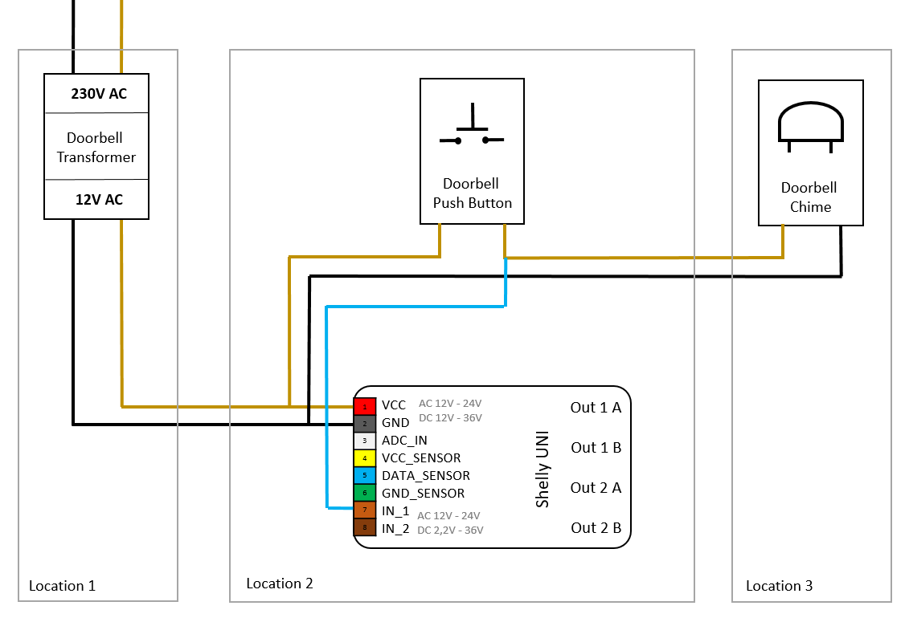

# smart-doorbell-shelly
A smart home doorbell integration using Shelly UNI and a generic doorbell transformer, enabling notifications and automation via MQTT or Home Assistant.

<!-- TOC -->

- [smart-doorbell-shelly](#smart-doorbell-shelly)
    - [Features](#features)
    - [Components](#components)
    - [Wiring Diagram - Connections Table](#wiring-diagram---connections-table)
    - [Wiring diagram](#wiring-diagram)
    - [Operation](#operation)
    - [Resources](#resources)
    - [Contributing](#contributing)
    - [License](#license)

<!-- /TOC -->

## Features
- Smart doorbell notifications
- Integration with smart home platforms
- Real-time monitoring of doorbell status
- Low-voltage control using Shelly UNI relay outputs

## Components
- Shelly UNI (Smart Wi-Fi device)
- Heidemann GT 3173 HDM (Doorbell transformer with 4V/8V/12V AC output)
- Heidemann Door Chime
- Existing doorbell wiring
- Optional: Smart home automation tools like Home Assistant, MQTT Broker, or Node-RED

## Wiring Diagram - Connections Table
Here is the wiring diagram for the Shelly Uni to be connected in parallel with the button to detect the button press, without controlling the gong directly:

| **Device/Component** | **Connection**   | **Description/Connection**                            |
|-----------------------|------------------|------------------------------------------------------|
| **Shelly UNI**        | VCC              | Parallel to the push button and 12V~ transformer     |
|                       | GND              | Parallel to the doorbell transformer and chime       |
|                       | ADC_IN           | Not connected (unused)                               |
|                       | VCC_SENSOR       | Not connected (unused)                               |
|                       | DATA_SENSOR      | Not connected (unused)                               |
|                       | GND_SENSOR       | Not connected (unused)                               |
|                       | IN_1             | To the doorbell push button minus (-) contact        |
|                       | IN_2             | Not connected (unused)                               |
| **Push Button**       | Button (1)       | Connection to IN_1 and 12V~ on Shelly UNI VCC        |
|                       | Button (2)       | Connection to the + of the doorbell chime            |
| **Doorbell Chime**    | Gong (A)         | Connection to the switched port of the button        |
|                       | Gong (B)         | Connection to the - of the transformer               |

## Wiring diagram

## Operation
- The button has a + terminal (for the gong) and connections to the Shelly Uni.
- The Shelly Uni is wired in parallel with the button, so it detects the button press (via IN and I1).
- The gong is not controlled by the Shelly Uni but is triggered directly by the button (via the + terminal of the button).
- The Shelly Uni only detects the button press and can be used for automations or notifications, without controlling the gong.
  
## Resources
- **Heidemann GT 3173 Datasheet** - `resources/Heidemann_70044_Transformator.pdf`
- **Heidemann Doorbell** - `resources/Heidemann_70169_Doorbell.pdf`
- **Shelly UNI Datasheet** - `resources/Shelly-UNI-User-Guide.pdf`
- **Gong melodies** - https://www.grothe.de/Download/Gongmelodien/

## Contributing
Contributions are welcome! Feel free to submit a pull request or open an issue for any bugs or feature requests.

## License
smart-doorbell-shelly and all individual scripts are under the BSD 3-Clause license unless explicitly noted otherwise. Please refer to the [LICENSE](LICENSE).