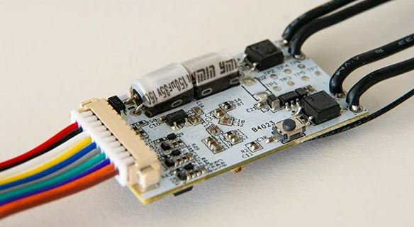
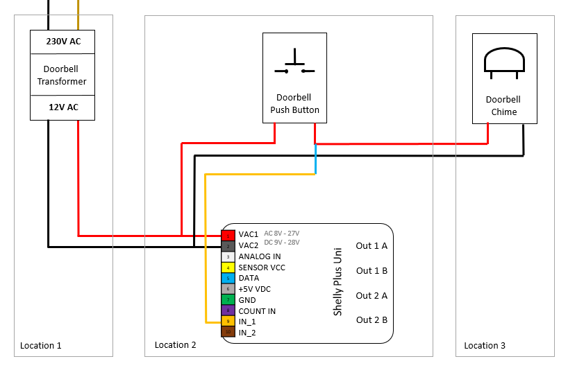
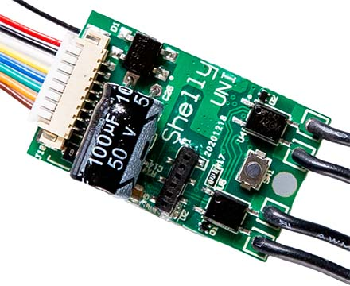
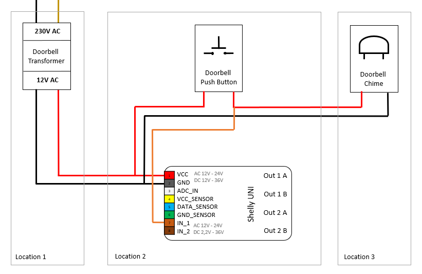

# smart-doorbell-shelly
A smart home doorbell integration using Shelly UNI and a generic doorbell transformer, enabling notifications and automation via MQTT or Home Assistant.

<!-- TOC -->

- [smart-doorbell-shelly](#smart-doorbell-shelly)
  - [Features](#features)
  - [Components](#components)
  - [Differences Between Shelly UNI and Shelly Plus UNI](#differences-between-shelly-uni-and-shelly-plus-uni)
  - [Wiring Table](#wiring-table)
    - [Shelly Plus UNI](#shelly-plus-uni)
    - [Shelly UNI](#shelly-uni)
  - [Operation](#operation)
  - [Resources](#resources)
  - [Contributing](#contributing)
  - [License](#license)

<!-- /TOC -->

## Features
- Smart doorbell notifications
- Integration with smart home platforms
- Real-time monitoring of doorbell status
- Low-voltage control using Shelly UNI relay outputs

## Components
- Shelly UNI or Shelly Plus Uni (Smart Wi-Fi device)
- Heidemann GT 3173 HDM (Doorbell transformer with 4V/8V/12V AC output)
- Heidemann Door Chime
- Existing doorbell wiring
- Optional: Smart home automation tools like Home Assistant, MQTT Broker, or Node-RED

## Differences Between Shelly UNI and Shelly Plus UNI

The Shelly Plus UNI stands out primarily for its wide range of supported input voltages, making it a versatile solution for various power supply scenarios while offering enhanced features compared to the standard Shelly UNI.

| **Feature**                | **Shelly UNI**                          | **Shelly Plus UNI**                     |
|----------------------------|-----------------------------------------|----------------------------------------|
| **Power Supply**           | 12-24 VAC / 12-36 VDC                  | 8-27 VAC / 9-28 VDC |
| **1-Wire Support**         | No                                     | Yes (SENSOR VCC, DATA) |
| **Internal Voltage Output**| None                                   | 3.3 VDC (Yellow wire) |
| **Processor**              | ESP8266                                | ESP32 (Improved performance) |

> **Important Note:**
> 
> When deciding between the **Shelly UNI** and the **Shelly Plus UNI**, the choice should primarily depend on the output voltage of the doorbell transformer and chime.
> 
> - If the transformer provides **12V AC**, the **Shelly UNI** is suitable.
> - If the transformer provides **less than 12V**, for example **8V AC**, the **Shelly Plus UNI** should be used to ensure proper functionality.
> 
> Make sure to check the output voltage of your doorbell transformer before making a purchase.

## Wiring Table

### Shelly Plus UNI

| **Connector**       | **Color**         | **Description**                                  | **Connection**                                     |
|---------------------|-------------------|--------------------------------------------------|----------------------------------------------------|
| **VAC1**            | Red               | 8-27 VAC / 9-28 VDC power supply input           | Parallel to the push button and 8V~                |
| **VAC2**            | Black             | 8-27 VAC / 9-28 VDC power supply input           | Parallel to the push button and 8V~                |
| **ANALOG IN**       | White             | Analog input                                     | Not connected                                      |
| **SENSOR VCC**      | Yellow            | Power supply for 1-Wire sensors (3.3 VDC output) | Not connected                                      |
| **DATA**            | Blue              | 1-Wire data signal                               | Not connected                                      |
| **+5 VDC**          | Grey              | 5 VDC positive power supply input                | Not connected                                      |
| **GND**             | Green             | Device ground                                    | Common ground                                      |
| **COUNT IN**        | Dark Brown        | Counter input                                    | Not connected                                      |
| **IN 1**            | Orange            | Digital input 1                                  | To the doorbell push button minus (-) contact      |
| **IN 2**            | Light Brown       | Digital input 2                                  | Not connected                                      |
| **OUT 1**           | -                 | Max Current: 100mA, Max Voltage: AC: 24V/DC: 36V | Not connected                                      |
| **OUT 2**           | -                 | Max Current: 100mA, Max Voltage: AC: 24V/DC: 36V | Not connected                                      |

### Shelly UNI

| **Connector**       | **Color**         | **Description**                                  | **Connection**                                     |
|---------------------|-------------------|--------------------------------------------------|----------------------------------------------------|
| **VCC**             | Red / Black-Red   | 12-36 VDC / 12-24 VAC                            | Parallel to the push button and 12V~ transformer    |
| **GND**             | Black / Green     | GND / Internal GND                               | Parallel to the doorbell transformer and chime      |
| **ADC_IN**          | White             | ADC Input                                        | Not connected (unused)                              |
| **VCC_SENSOR**      | Yellow            | VCC 3.3 VDC output                               | Not connected (unused)                              |
| **DATA_SENSOR**     | Blue              | DATA                                             | Not connected (unused)                              |
| **GND_SENSOR**      | Green             | Internal GND                                     | Not connected (unused)                              |
| **IN_1**            | Light Brown       | Input 1                                          | To the doorbell push button minus (-) contact       |
| **IN_2**            | Dark Brown        | Input 2                                          | Not connected (unused)                              |
| **OUT_1**           | -                 | Max Current: 100mA, Max Voltage: AC: 24V/DC: 36V | -                                                   |
| **OUT_2**           | -                 | Max Current: 100mA, Max Voltage: AC: 24V/DC: 36V | -                                                   |

## Operation
- The button has a + terminal (for the gong) and connections to the Shelly Uni.
- The Shelly Uni is wired in parallel with the button, so it detects the button press (via IN and I1).
- The gong is not controlled by the Shelly Uni but is triggered directly by the button (via the + terminal of the button).
- The Shelly Uni only detects the button press and can be used for automations or notifications, without controlling the gong.
  
## Resources
- **Heidemann GT 3173 Datasheet** - `resources/Heidemann_70044_Transformator.pdf`
- **Heidemann Doorbell** - `resources/Heidemann_70169_Doorbell.pdf`
- **Shelly UNI Datasheet** - `resources/Shelly-UNI-User-Guide.pdf`
- **Gong melodies** - https://www.grothe.de/Download/Gongmelodien/

## Contributing
Contributions are welcome! Feel free to submit a pull request or open an issue for any bugs or feature requests.

## License
smart-doorbell-shelly and all individual scripts are under the BSD 3-Clause license unless explicitly noted otherwise. Please refer to the [LICENSE](LICENSE).